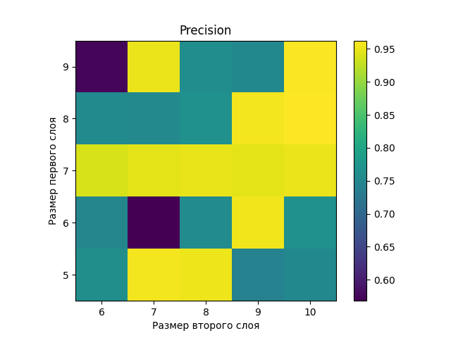
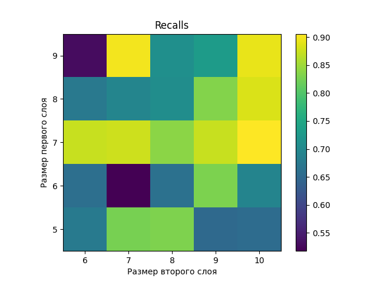
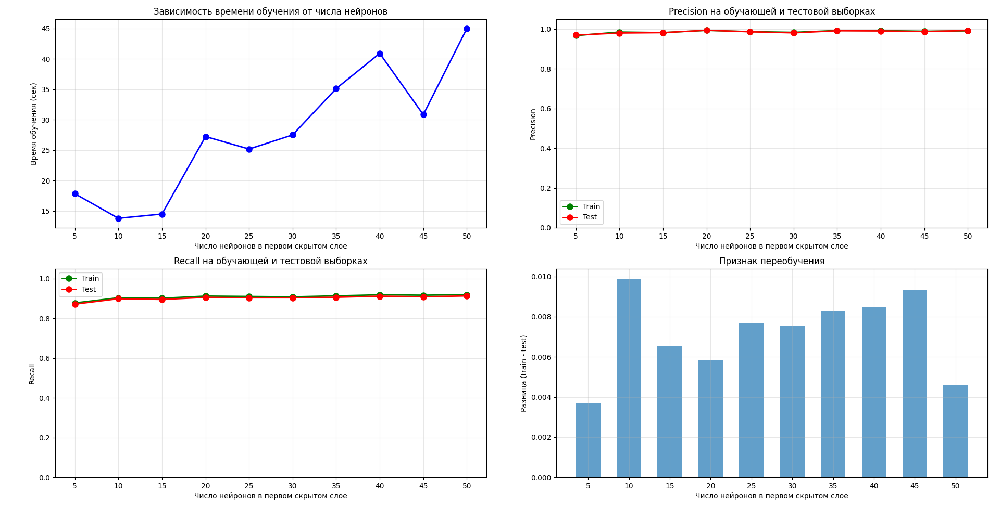
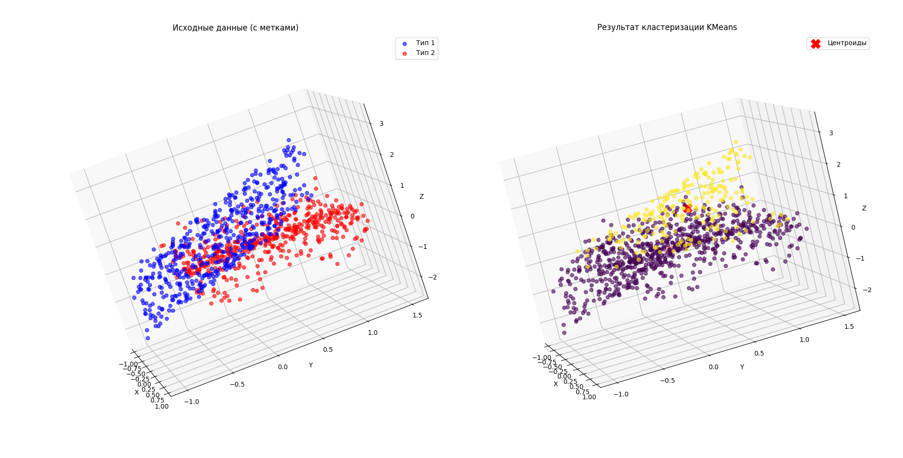
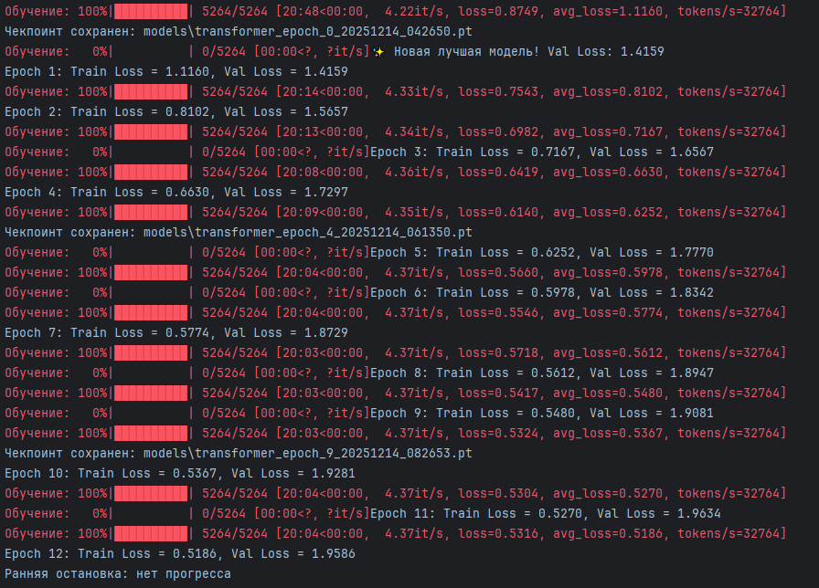
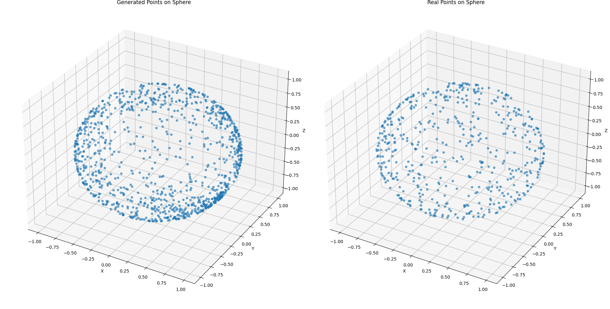
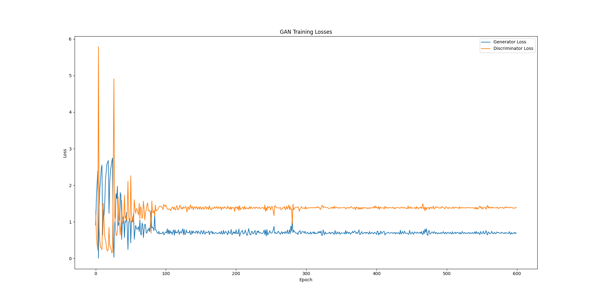

# Machine learning course labs — MIPT

Eight lab assignments from the machine learning course at MIPT, autumn 2025, plus a fuzzy-logic
control exercise. The set runs from classical methods on generated data (regression,
classification, clustering) to neural networks in PyTorch (CNN, autoencoder, transformer, GAN).

Each lab is one self-contained script. Assignments were handed out in numbered variants; where a
variant was assigned, it is recorded in the docstring at the top of the file. Comments and console
output are in Russian.

| # | Script | Topic | Main tools |
|---|--------|-------|------------|
| 1 | [`lab1_regression.py`](lab1_regression.py) | Linear regression vs kernel ridge, and a hand-written Nadaraya–Watson estimator | scikit-learn |
| 2 | [`lab2_classification.py`](lab2_classification.py) | Three 3-D point clouds, three ways of grouping them into classes | LogisticRegression, LDA, GaussianMixture, Gaussian process |
| 3 | [`lab3_perceptron.py`](lab3_perceptron.py) | Multilayer perceptron: hand-computed weights, layer-size grid, neuron sweep | MLPClassifier, joblib |
| 4 | [`lab4_clustering.py`](lab4_clustering.py) | Clustering numeric points and short texts | KMeans, TF-IDF |
| 5 | [`lab5_cnn.py`](lab5_cnn.py) | CNN on two CIFAR-10 classes: kernel count and residual connections | PyTorch |
| 6 | [`lab6_autoencoder.py`](lab6_autoencoder.py) | Autoencoder on CIFAR-10: latent size and latent-space interpolation | PyTorch |
| 7 | [`lab7_transformer.py`](lab7_transformer.py) | Character-level transformer language model on WikiText-2 | PyTorch |
| 8 | [`lab8_gan.py`](lab8_gan.py) | GAN generating points on a sphere | PyTorch |
| — | [`fuzzy_pendulum.py`](fuzzy_pendulum.py) | Fuzzy controller stabilising an inverted pendulum with a control delay | scikit-fuzzy |

---

## 1. Regression

Sample of points `(x, x²)` with `x ~ N(3, 1)`. Ordinary least squares and kernel ridge regression
from scikit-learn are compared against [`kernel_smoothing.py`](kernel_smoothing.py) — my own
Nadaraya–Watson local weighting, deliberately **not** a reimplementation of `KernelRidge`: it
weights training answers by a Gaussian of the distance instead of solving a regularised system.

The random seed is fixed, so the run is reproducible:

| Model | Mean error |
|---|---|
| `LinearRegression` | 0.141 |
| `KernelRidge` (RBF) | 0.171 |
| `MyGaussKernelSmoothing` | 0.371 |

Local weighting loses to both library methods here: with 100 points and a bandwidth derived from
the data variance, its error is more than double that of the plain linear fit.

## 2. Classification

Three groups of 3-D points — the surface of a lower hemisphere, the interior of an upper
half-ball, and points of the form `(x, y, exp(x−y) + ε)` — combined into classes three different
ways: 1 vs 2+3, 1+2 vs 3, and each group on its own. Every split is fitted with logistic
regression, linear discriminant analysis and a Gaussian mixture, and scored by precision, recall
and accuracy per class. The last part fits a Gaussian process regressor to one of the clouds.

The interesting part is where the models break down rather than the headline accuracy: on some of
the splits macro precision collapses to about a third, with per-class precision `[0, 0.66]` — one
of the classes is never predicted at all.

## 3. Multilayer perceptron

Run a part by number, `1` if omitted:

```bash
python lab3_perceptron.py 2
```

**Part 1** builds a three-layer network by hand — the weights and biases are written out
explicitly rather than trained — and draws the linear and activated output of every layer, showing
how the first layer cuts the plane into half-planes and the later ones assemble two disjoint
squares out of them.

**Part 2** trains 125 networks (5 first-layer sizes × 5 second-layer sizes × 5 repeats, in
parallel via joblib) and averages precision and recall over the repeats.

<p align="center">
  
  
</p>

**Part 3** moves to a 3-D problem — a cube, a half-space and a slab between two planes — and
sweeps the first hidden layer from 5 to 50 neurons.



Quality saturates almost immediately: precision holds around 0.98–0.99 and recall around
0.90–0.92 across the whole range, while training time grows roughly threefold. The train–test gap
stays under 0.01, so nothing overfits — the extra neurons simply cost time.

## 4. Clustering

Numeric part: two clouds of points in 3-D, clustered with KMeans and scored by the Davies–Bouldin
index and mutual information.



Text part: twenty short film reviews, ten positive and ten negative, vectorised with TF-IDF and
clustered with KMeans. It fails completely — mutual information is exactly `0.0000` and the split
is 2/2 against 8/8, i.e. the clusters have nothing to do with sentiment. Twenty documents of a
hundred features are simply not enough for the bag of words to separate them.

Appending shared marker words to each group (`"cool like"` to the positive reviews, `"bad worst"`
to the negative ones) raises mutual information to `0.6931` — exactly `ln 2`, the maximum for two
balanced clusters — and splits them 10/0 and 0/10. That is the expected outcome rather than a
result: the marker words *are* the label, so this shows how the clustering reacts to a clean
signal, not that the sentiment problem was solved. Full output: [`results/lab4_output.pdf`](results/lab4_output.pdf).

## 5. Convolutional network

Binary classification of CIFAR-10 classes 0 and 1 (airplane vs automobile). Four convolution
blocks, each `Conv2d → BatchNorm → ReLU → MaxPool`, feeding a three-layer MLP head with dropout.
The number of kernels is swept, and the same network is then rebuilt with residual connections
(`RCNN` inherits from `CNN` and only overrides the forward pass and the head size).

Accuracy after 100 epochs, from [`results/lab5_training_log.pdf`](results/lab5_training_log.pdf):

| Kernels | Accuracy | Training time |
|---|---|---|
| 8 | 92.75 % | 47.6 s |
| 16 | 95.95 % | 36.2 s |
| 32 | 94.30 % | 52.7 s |
| 64 | 96.30 % | 89.5 s |
| 16, residual | 96.75 % | 60.3 s |

The residual version with 16 kernels beats the plain network with 64 while training in two thirds
of the time. Note also that in most of the configurations test loss drifts upward over the second
half of the run while accuracy holds — the networks grow more confident, not more accurate.

## 6. Autoencoder

Two-layer encoder and decoder (`3 × 32 × 32 → 256 → latent`) on the same two CIFAR-10 classes as
lab 5, trained for latent sizes 30, 60 and 120 and compared by reconstruction MSE. The script
also walks a straight line between two images in latent space and decodes the intermediate points.

## 7. Transformer language model

A character-level language model on WikiText-2: learned token embeddings plus sinusoidal
positional encoding, 6 transformer blocks, 8 heads, `d_model = 256`, context 128 characters,
AdamW. Checkpoints are written every few epochs and training can resume from the last one.



Training loss falls from 1.12 to 0.52 over twelve epochs while validation loss climbs steadily
from 1.42 to 1.96, and the early-stopping rule cuts the run off. An epoch takes about twenty
minutes at roughly 33 000 tokens/s (the device setup in the code is written for an RTX 3060).

## 8. GAN

A generator maps a 10-dimensional latent vector to two angles through a `tanh`, and those angles
are turned into a point on the unit sphere. So the generator cannot produce an off-sphere point by
construction — the adversarial game is only about the *distribution* over the sphere, not about
the geometry. The discriminator, in contrast, sees raw 3-D coordinates.





## Fuzzy controller

Not part of the numbered series. An inverted pendulum is simulated with an explicit control delay
(0.3 s at a 0.01 s step, i.e. the regulator acts on a state 30 steps old), and a Mamdani fuzzy
controller built with scikit-fuzzy holds it upright: angle and angular velocity are fuzzified into
three terms each, and two rules map them to the applied torque.

---

## Layout

```
lab1_regression.py  …  lab8_gan.py   solutions, one file per lab
kernel_smoothing.py                  Nadaraya–Watson estimator used by lab 1
fuzzy_pendulum.py                    fuzzy control exercise
course-examples/                     example scripts handed out with the course
plots/                               figures produced by the labs
results/                             console output of labs 4 and 5
```

`course-examples/` is not my work — those are the reference scripts distributed with the course,
kept here because labs 3 and 4 build on them.

## Running

```bash
pip install -r requirements.txt
python lab1_regression.py
```

Run from the repository root: labs 5–7 write datasets to `./data` and checkpoints to `./models`,
both git-ignored.

CIFAR-10 (labs 5 and 6) downloads itself on first run. WikiText-2 (lab 7) does not — put the
tokenised `train.txt` and `test.txt` into `data/wikitext-2/`. The files come from the WikiText-2
dataset (`wikitext-2-v1`, the version with `<unk>` tokens, not the raw one); it is on the Hugging
Face Hub as `Salesforce/wikitext`.

Labs 5–8 and the transformer in particular expect a CUDA GPU; on CPU they will run but slowly.

## Known limitations

- Only lab 1 fixes a random seed. Everything else moves between runs, so the numbers quoted above
  are one run each, not averages.
- The text part of lab 4 works on twenty hand-written reviews. Anything read from that section is
  about the mechanics of TF-IDF plus KMeans, not about sentiment analysis.
- `plots/lab7_training_log.png` is a screenshot of the original December 2025 run. That run built
  the validation vocabulary from the validation text instead of reusing the training alphabet, so
  its validation losses are not comparable with what the current code produces — see the `vocab`
  argument of `TextDataset`.
- Lab 6 saves a checkpoint per latent size into `./models` without cleaning up after itself.
